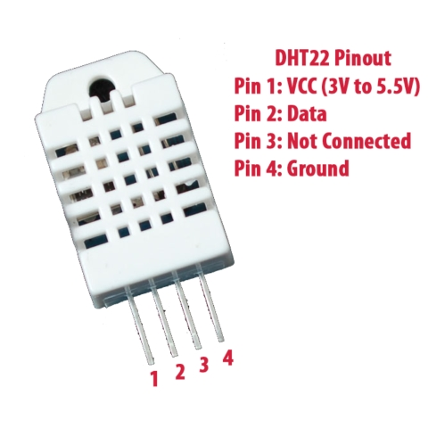

## DHT22 (AM2302) driver for ESP8266.

ESP8266 driver for very popular DHT22 (AM2302) temperature and humidity sensor.

Before you can get the temperature and humidity from DHT22 you have to call 
`esp_dht22_init`. You need to call it only once unless you change the GPIO
pin setup somewhere else in your code.

See [example program](../../examples/dht22) and driver documentation 
in [esp_dht22.h](include/esp_dht22.h) header file for more details.
