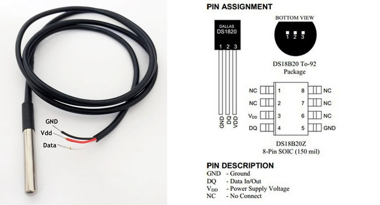

## DS18B20 driver for ESP8266.

Full featured DS18B20 digital thermometer driver.



Before you can get the temperature from DS18B20 you have to call 
`esp_ds18b20_init`. You need to call it only once unless you change the GPIO
pin setup somewhere else in your code.

To find device(s) on the OneWire bus you can use `esp_ds18b20_search` which 
will give you linked list of `esp_ow_device` devices.

It's up to the user to release memory allocated for the linked list with 
library provided helper function `esp_ds18b20_free_list` when it's not needed 
anymore.

Most of the operations with the DS18B20 library is based on passing pointers 
to the `esp_ow_device` structure which has pointer to `esp_ds18b20_st` 
status structure. The `esp_ds18b20_st` keeps track of last scratch pad read
the last temperature conversion.

```
esp_ow_device *device;
esp_ds18b20_st *st = device->custom;
```  

If you already know the ROM address of your device you can use 
`esp_ds18b20_new_dev`:

```
uint8_t rom[8] = {0x28, 0x1D, 0x39, 0x31, 0x2, 0x0, 0x0, 0xF0}
esp_ow_dev *device = esp_ds18b20_new_dev(rom);

``` 

With DS18B20 temperature measurement takes between 94 and 750ms depending 
on resolution. You don't want to block the CPU for that long waiting for 
example using some kind of delay. That's why library is using event bus 
(esp_eb) to emmit events when the temperature conversion is ready to read.
Check [example program](../../examples/ds18b20_temp) to see how it should be 
done.   

See driver documentation in [esp_ds18b20.h](include/esp_ds18b20.h) header file 
for more details.
