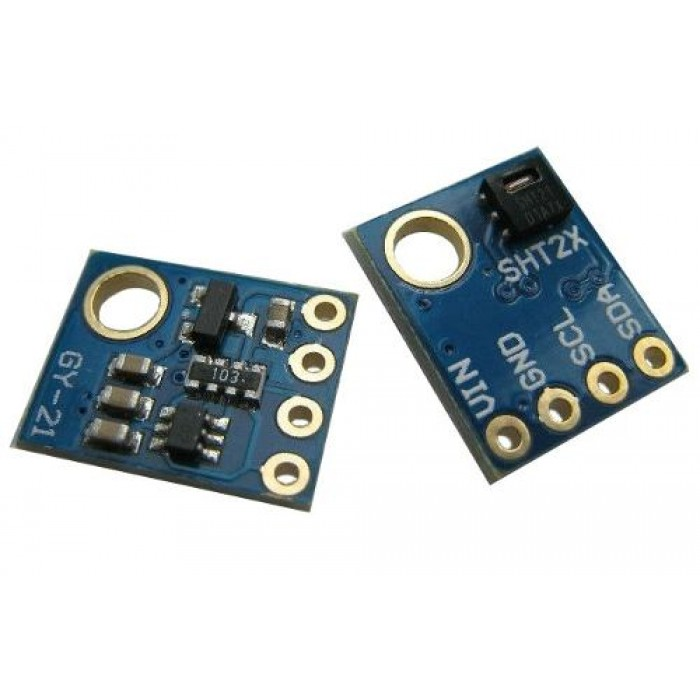

## SHT21 driver for ESP8266.

SHT21 a.k.a Si7021 driver for ESP8266. Features:

- Humidity and temperature measurements.
- Get/set humidity and temperature measurement resolution.
- Get SHT21 serial number.
- Get SHT21 firmware revision.
- Turn on on-board heater to drive off condensation.

Before you can start communicating with SHT21 you have to call 
`esp_sht21_init`. You need to call it only once unless you change the GPIO
pins setup somewhere else in your code.

See driver documentation in [esp_sht21.h](include/esp_sht21.h) header file 
for more details.
